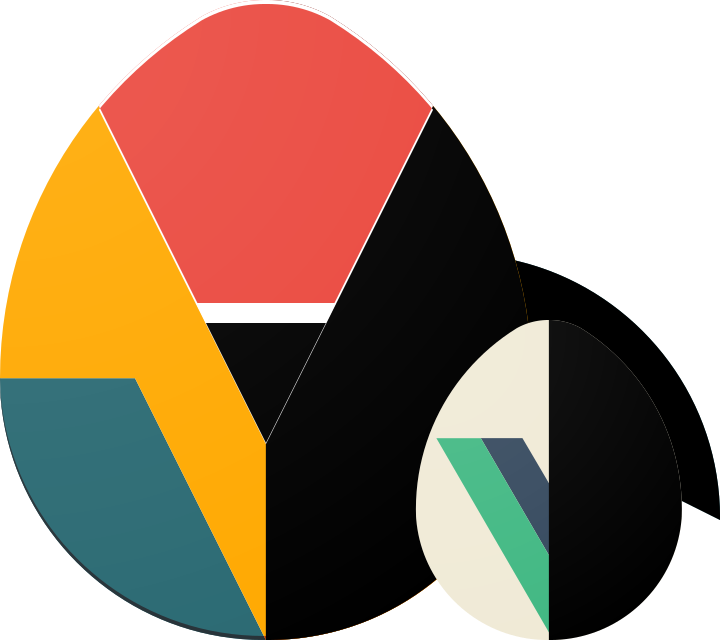

<h1 align="center">vuegg</h1>
<p align="center">
  <a href="https://vuegg.now.sh" target="_blank">
    
  </a>
</p>
<p align="center"><strong>vue</strong>.js <strong>G</strong>UI <strong>g</strong>enerator</p>

---

## Auto-run
``` bash
# install, build and serve
npm run vuegg
```
Navigate to `localhost:5000` to serve (a production-ready) vuegg.

---

## Step-by-step setup

#### installation
``` bash
# install client & server dependencies
npm run install:all

# OR install only client / server
npm run install:client
npm run install:server
```
---

#### development
``` bash
# serve vuegg-client with hot reload
npm run client

# start vuegg-server (auto-restarts on changes)
npm run server
```
Navigate to `localhost:8080` to serve *vuegg-client* with hot-reload (development server).

> For detailed explanation on how things work on the client side, checkout the **[vuejs-templates/webpack](http://vuejs-templates.github.io/webpack/)** guide and docs for **[vue-loader](http://vuejs.github.io/vue-loader)**.

> For development *vuegg-server* will only generate vuejs projects (it won't be serving *vuegg-client* resources). Auto-restart capabilities possible thanks to **[nodemon](https://github.com/remy/nodemon)**.

> BE AWARE that the above commands should be run in separate terminal instances.

---

#### production
``` bash
# build vuegg-client for production with minification
npm run build

# start vuegg-server at localhost:5000
npm run start
```
Navigate to `localhost:5000` to serve (a production-ready) vuegg.
